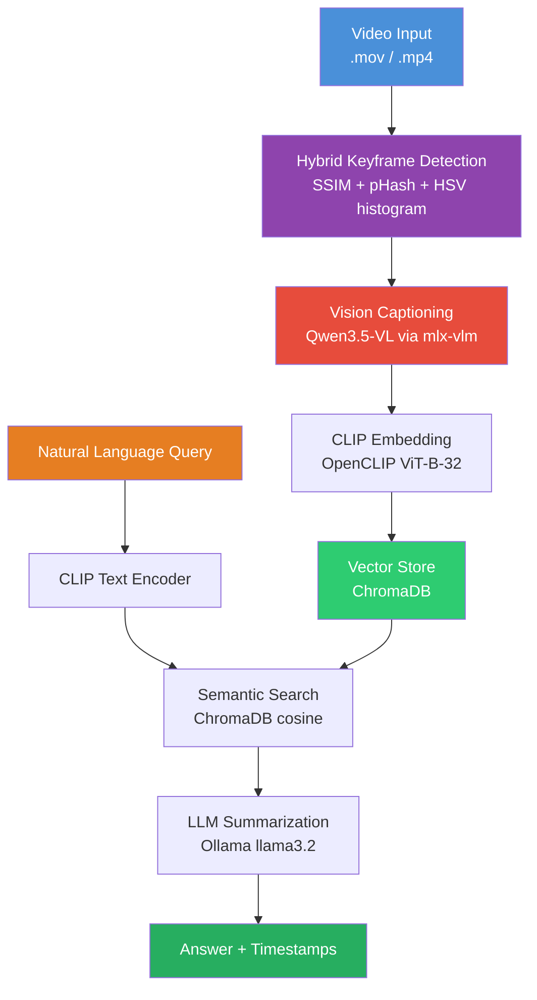
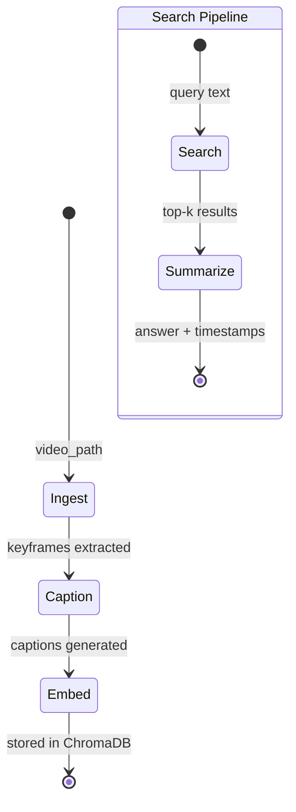

# ScreenLens

[](https://python.org)
[](https://developer.apple.com/metal/)
[](https://github.com/langchain-ai/langgraph)
[]()
[](https://github.com/ai-agents-cybersecurity)
[](https://anthropic.com)
[](LICENSE)

Local video scene intelligence for Apple Silicon. Processes screen recordings through a LangGraph-orchestrated pipeline: smart keyframe extraction, Qwen3.5-VL captioning via MLX, CLIP embedding, vector search, and LLM-powered summarization — all running on your machine with no cloud dependencies. Inspired by NVIDIA VSS, rebuilt from scratch for Apple Silicon.

## Demo


## Architecture



## Pipeline Flow (LangGraph)



## Component Overview

| Component | Technology | Purpose |
|-----------|-----------|---------|
| Frame Extraction | **Hybrid keyframe detection** (SSIM + pHash + HSV) | Only captures distinct screens — skips duplicates |
| Vision Captioning | **Qwen3.5-VL** via mlx-vlm (Apple Silicon native) | Dense, high-fidelity frame descriptions, batched via `mlx_vlm.batch_generate` (default 4 frames/call) |
| Fallback Captioning | Ollama (llama3.2-vision) | Cross-platform alternative |
| Visual Embeddings | OpenCLIP ViT-B-32 | Semantic vector representations |
| Vector Storage | ChromaDB | Persistent similarity search |
| Text Search | CLIP text encoder | Query → embedding |
| Summarization | Ollama (llama3.2) | Natural language answers |
| Orchestration | LangGraph StateGraph | Pipeline state management |
| CLI | Typer + Rich | User interface |

## Prerequisites

- **Hardware**: Apple Silicon Mac (M1+). Optimized for M3 Ultra with 512GB unified memory.
- **Python 3.11+**
- **ffmpeg**: `brew install ffmpeg`
- **Ollama** (for summarization): Install from [ollama.com](https://ollama.com) and pull:

```bash
ollama pull llama3.2           # Text model for summarization
ollama pull llama3.2-vision    # Only needed if using --backend ollama for captioning
```

The Qwen3.5-VL MLX model downloads automatically on first use (~20GB for 4-bit).

## Installation

```bash
cd screenlens
pip install -e .
```

## Usage

### 1. Ingest a Video (recommended — Qwen3.5 + keyframes)

```bash
python -m src.cli ingest "Screen Recording 2026-04-04 at 8.33.55 AM.mov"
```

This uses smart keyframe detection (only captures when the screen actually changes) and Qwen3.5-122B-A10B via MLX for high-fidelity captions.

### 2. Ingest with Ollama (alternative)

```bash
python -m src.cli ingest "video.mov" --backend ollama --strategy fixed_fps --fps 1.0
```

### 3. Use a smaller Qwen3.5 model

```bash
python -m src.cli ingest "video.mov" --mlx-repo mlx-community/Qwen3.5-35B-A3B-4bit
```

Captioning runs in batches of 4 frames per `mlx_vlm.batch_generate` call by default. To override:

```bash
python -m src.cli ingest "video.mov" --batch-size 8
```

The default of 4 was empirically tuned on M3 Ultra 512GB with the 122B model — see the [Performance Notes](#performance-notes) section. If you switch to a smaller model, re-run `scripts/bench_caption_batch.py` to find the new optimum.

### 4. Batch-Ingest a Folder of Videos

```bash
python -m src.cli batch "/path/to/recordings/"
```

Each video gets its own data directory under `./data/<video_name>/` with separate frames, captions, embeddings, and ChromaDB collections.

### 5. Search the Video

```bash
python -m src.cli search "What application is being demonstrated?"
python -m src.cli search "Show me any error messages or warnings"
python -m src.cli search "What buttons or menus are visible?"
```

### 6. One-Shot (Ingest + Search)

```bash
python -m src.cli run "video.mov" "Summarize what happens in this screen recording"
```

### 7. Reconstruct Artifacts from Recordings

```bash
python -m src.cli reconstruct
```

Scans all folders in `./data/`, classifies each recording (Python code, Markdown doc, PDF, or GUI demo), and uses LangGraph deep agents to reconstruct the original artifacts. Features:

- **Classification** — Auto-detects content type from captions
- **Parallel sub-agents** — Fan-out via LangGraph `Send` when tasks are independent
- **Reflection QA** — Up to 3 iterations of quality review before saving
- **Output** — Reconstructed files saved to `./data/<video_name>/output/`

### 8. Check Status

```bash
python -m src.cli info
```

## Keyframe Detection

The hybrid change detector uses three complementary signals to decide when the screen has actually changed:

| Signal | What it detects | Threshold |
|--------|----------------|-----------|
| **SSIM** (Structural Similarity) | Pixel-level structural changes | < 0.97 |
| **pHash** (Perceptual Hash) | Perceptual content changes via DCT | hamming >= 8 |
| **HSV Histogram** | Color distribution shifts | correlation <= 0.90 |

A keyframe is emitted when any signal triggers AND enough time has passed (min 0.5s). A forced keyframe is always emitted every 4s (configurable) to catch slow scrolls.

For a typical screen recording, this captures 5-15% of frames vs. fixed FPS, dramatically reducing captioning time while missing nothing.

## Configuration

All settings live in `src/config.py` (Pydantic models). Key parameters:

| Parameter | Default | Description |
|-----------|---------|-------------|
| `frame_extraction.strategy` | keyframe | `keyframe` (smart) or `fixed_fps` |
| `frame_extraction.max_interval_seconds` | 4.0 | Max gap between keyframes |
| `captioning.backend` | mlx_vlm | `mlx_vlm` (Qwen3.5) or `ollama` |
| `captioning.mlx_repo_id` | Qwen3.5-122B-A10B-bf16 | HuggingFace MLX model (override with `--mlx-repo`) |
| `captioning.batch_size` | 4 | Frames per `mlx_vlm.batch_generate` call (MLX backend only) |
| `captioning.max_tokens` | 1024 | Max tokens per caption |
| `embedding.model_name` | ViT-B-32 | CLIP model |
| `embedding.device` | mps | Apple Silicon GPU |
| `search.top_k` | 10 | Results per query |

## Performance Notes

Captioning is parallelized via `mlx_vlm.batch_generate`, which packs multiple frames into a single forward pass with a shared KV cache and zero-padding within same-shape image groups. The default `batch_size=4` was empirically tuned on M3 Ultra 512GB with `Qwen3.5-122B-A10B-bf16`: it gives a real ~1.5× aggregate throughput improvement over `batch_size=1`, while `batch_size=8` regresses (likely MoE expert dispersion at higher batch sizes). Memory was not the constraint — peak GPU usage stayed under 270 GB out of 512 GB at every tested batch size.

On Apple Silicon with large vision inputs, **prefill (vision encoder + prompt) dominates per-frame time, not decode**. This means that the main lever for further wall-clock improvement is *not* a larger batch size — it's a smaller model (e.g. `Qwen3.5-35B-A3B-4bit`) or a smaller `frame_extraction.max_dimension`. Re-run `scripts/bench_caption_batch.py` whenever you change the model to find the new optimum.

The captioner installs a module-level monkey-patch on `mlx_vlm.generate.apply_chat_template` to inject `enable_thinking=False`. This is required because Qwen3.5-VL's chat template prepends `<think>` to the assistant turn, and `mlx_vlm.batch_generate` does not forward kwargs to `apply_chat_template`, so without the patch ~50% of every caption's token budget gets burned on planning prose before the structured response. The patch is idempotent and a no-op for non-Qwen models.

## Project Structure

```
src/
  config.py          # Pydantic configuration (extraction, captioning, embedding, search)
  frame_extractor.py # Hybrid keyframe detection + fixed FPS fallback
  captioner.py       # Dual backend: mlx-vlm (Qwen3.5) + Ollama; batched via batch_generate
  embedder.py        # CLIP embedding via OpenCLIP
  vector_store.py    # ChromaDB storage + search
  pipeline.py        # LangGraph StateGraph orchestration (ingest/search/summarize)
  reconstruct.py     # LangGraph deep agents — artifact reconstruction with QA reflection
  cli.py             # Typer CLI interface
scripts/
  bench_caption_batch.py  # MLX-VLM batch-size sweep + frames/sec & peak-memory plot
data/
  frames/            # Extracted keyframe images
  captions/          # JSON caption files
  chromadb/          # Persistent vector database
tests/
  test_pipeline.py   # Integration tests
  test_cases.yaml    # Use-case definitions + computer-use agent script
```

## How It Compares to NVIDIA VSS

| Feature | NVIDIA VSS | ScreenLens |
|---------|-----------|-----------|
| Frame extraction | Custom + TensorRT | Hybrid keyframe detection (SSIM/pHash/HSV) |
| Vision model | NVIDIA VILA | **Qwen3.5-VL** via mlx-vlm |
| Embeddings | TensorRT Visual Encoder | OpenCLIP ViT-B-32 |
| Vector DB | Milvus | ChromaDB |
| LLM | Llama 3.1 70B (NIM) | Ollama (configurable) |
| Hardware | NVIDIA GPU (DGX) | **Apple Silicon (M-series)** |
| Deployment | Docker + NIM | pip install |
| Cloud dependency | None (self-hosted) | None (fully local) |

## Roadmap

### Duplicate Detection
- [ ] Harden near-duplicate keyframe filtering (perceptual hash + SSIM fusion threshold tuning)
- [ ] Cross-video deduplication for multi-file ingestion
- [ ] Consider leveraging [Karpathy's autoresearch](https://github.com/karpathy/autoresearch) — its autonomous agent architecture is a natural fit for iterating on dedup thresholds and evaluating detection quality at scale

### Video Profiles

Pre-configured extraction & captioning strategies tailored to content type:

| Profile | Description | Audio | Typical Source |
|---------|------------|-------|----------------|
| **`code`** | Silent screen recording of browsing / editing code | No | IDE walkthroughs, code reviews |
| **`demo`** | Screencast with voice-over demonstrating software | Yes | Product demos, tutorials, onboarding videos |
| **`pdf`** | Continuous scroll/browse of a PDF document | No | Recorded PDF read-throughs, slide decks |
| **`meeting`** | Video call or presentation recording | Yes | Zoom/Teams recordings, webinars |

Each profile auto-tunes: frame extraction strategy, captioning prompt, chunking window, and whether the audio pipeline is activated.

### Audio Support (Whisper)
- [ ] Integrate Whisper speech-to-text via **ONNX Runtime** and/or **MLX**
- [ ] Support model sizes: `small`, `medium`, `large`
- [ ] Word-level timestamps aligned to keyframe timeline
- [ ] Fused caption+transcript context for richer semantic search
- [ ] Profile-aware activation — auto-enabled for `demo` and `meeting`, skipped for `code` and `pdf`

### Output Generators (LangGraph Deep Agents)

Agentic pipelines that consume ingestion results and produce structured deliverables:

- [ ] **Manual Generator** (`demo` profile) — Watch a software demo and auto-generate a step-by-step user manual with extracted screenshots, annotated UI elements, and navigation flow
- [ ] **PDF Summary** (`pdf` profile) — Ingest a screen-recorded PDF browse and produce a structured summary document preserving headings, key points, and referenced figures
- [ ] **Source Code Reconstruction** (`code` profile) — Scan a code walkthrough video and reconstruct/export the visible source files, function signatures, and project structure
- [ ] **Meeting Notes** (`meeting` profile) — Transcribe + summarize a recorded meeting with action items, decisions, and speaker attribution

Each generator is implemented as a LangGraph sub-graph with its own state machine, allowing composition, retry, and human-in-the-loop review before final export.
