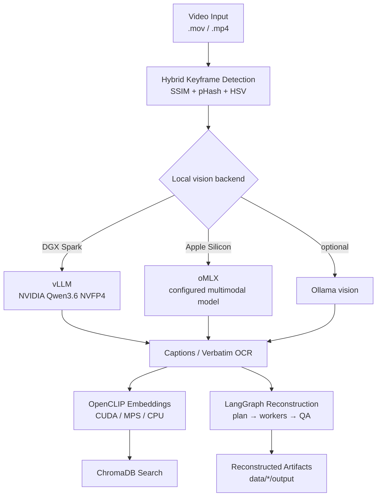

# ScreenLens

[](https://python.org)
[](docs/DGX_SPARK.md)
[](https://developer.apple.com/metal/)
[](https://github.com/langchain-ai/langgraph)
[]()
[](https://github.com/ai-agents-cybersecurity)
[](LICENSE)

Local video scene intelligence for NVIDIA DGX Spark and Apple Silicon. ScreenLens extracts meaningful frames from screen recordings, captions or transcribes them with a local multimodal model, embeds them with OpenCLIP, indexes them in ChromaDB, and reconstructs visible code, documents, PDFs, and GUI walkthroughs. Linux/ARM64 uses vLLM + CUDA by default; Apple Silicon uses oMLX + MPS. Ollama remains an optional fallback.

## Demo


## Architecture



The vLLM and oMLX paths share the same small OpenAI-compatible client, including image data URLs and `chat_template_kwargs.enable_thinking=false` for Qwen-style models. Platform detection changes defaults, not the pipeline itself.

## Component Overview

| Component | Technology | Purpose |
|---|---|---|
| Frame extraction | Hybrid SSIM + pHash + HSV detection | Capture distinct screens while bounding long static intervals |
| DGX vision/text | `nvidia/Qwen3.6-35B-A3B-NVFP4` via vLLM | Caption frames, perform OCR, summarize, and reconstruct through one local model |
| Apple vision/text | Configured multimodal model via oMLX | Native Apple Silicon OpenAI-compatible inference |
| Optional fallback | Ollama | Alternative captioning and summarization when explicitly selected |
| Visual embeddings | OpenCLIP ViT-B-32 | Semantic image/text vectors on CUDA, MPS, or CPU |
| Vector storage | ChromaDB | Persistent per-video semantic search |
| Reconstruction | LangGraph | Classify recordings and rebuild code/docs/demo artifacts with QA retries |
| Interfaces | Typer + Rich, optional Textual | CLI and terminal GUI |

## Platform Defaults

| Host | Inference | Embeddings | Concurrent image requests |
|---|---|---|---:|
| Linux ARM64 / DGX Spark | vLLM | CUDA | 2 |
| Darwin ARM64 / Apple Silicon | oMLX | MPS | 4 |
| Other hosts | oMLX unless overridden | CPU | 4 |

Caption output is capped at 4,096 tokens by default. This leaves room for the image and prompt inside the bundled Spark service's 32K total context window.

## Installation

### NVIDIA DGX Spark

The checked helper creates an isolated Python 3.12 CUDA environment, validates the host and OpenCLIP, starts or reuses the exact vLLM model, and performs a real vision smoke test:

```bash
(umask 077; touch .env)
chmod 600 .env
${EDITOR:-nano} .env  # add HF_TOKEN=hf_... if ScreenLens must start vLLM

./setup_and_run_dgx.sh doctor
./setup_and_run_dgx.sh setup
./setup_and_run_dgx.sh llm-up
./setup_and_run_dgx.sh llm-wait
./setup_and_run_dgx.sh smoke
./setup_and_run_dgx.sh run
```

`run` launches the TUI with no arguments or passes a CLI command through:

```bash
./setup_and_run_dgx.sh run ingest input-videos/demo.mov
./setup_and_run_dgx.sh run transcribe input-videos/demo.mov
```

DigitalTwin uses the same model and loopback port. The helper reuses an already-ready exact-model service instead of starting a conflicting container. See [the complete DGX Spark guide](docs/DGX_SPARK.md) for CUDA wheel pins, cache sharing, memory sizing, service ownership, and troubleshooting.

### Apple Silicon / Conda

Start oMLX on `http://127.0.0.1:8000/v1`, configure `MLX_*` or `OMLX_*` values in `.env`, then use the existing Conda launcher:

```bash
./setup_and_run_macos.sh
./setup_and_run_macos.sh ingest "video.mov"
```

The script creates a `screenlens` Conda environment with Python 3.11 and ffmpeg, installs the TUI extra, preserves an existing `.env`, and defaults to the TUI. Set `SCREENLENS_CONDA_ENV` to choose another environment name. On Linux/ARM64 it exits with directions to the checked Spark helper so a generic pip install cannot replace CUDA 13 wheels with CPU wheels.

### Manual development install

```bash
pip install -e ".[dev,tui]"
pytest tests/ -v
```

Install ffmpeg separately and ensure the selected inference server is running. Ollama is not required for the normal vLLM or oMLX paths.

## Usage

### Provider Selection

Commands that contact the direct inference service accept provider-neutral flags:

```bash
python -m src.cli ingest video.mov \
  --backend vllm \
  --inference-url http://127.0.0.1:8000/v1 \
  --inference-model nvidia/Qwen3.6-35B-A3B-NVFP4 \
  --inference-api-key local \
  --device cuda \
  --batch-size 2
```

`--vllm-url`, `--vllm-model`, and `--vllm-api-key` are provider-specific aliases; the existing `--omlx-*` spellings remain compatible. `SCREENLENS_BACKEND`, `SCREENLENS_DEVICE`, and `SCREENLENS_BATCH_SIZE` override platform defaults. Provider credentials and models can also come from `VLLM_*`, `MLX_*`, or `OMLX_*` variables as appropriate.

### Ingest and Search

```bash
# Uses vLLM/CUDA on DGX Spark or oMLX/MPS on Apple Silicon.
python -m src.cli ingest "video.mov"

# Optional Ollama captioning fallback.
python -m src.cli ingest "video.mov" --backend ollama --strategy fixed_fps --fps 1

# Search one or all timestamped collections and synthesize an answer locally.
python -m src.cli search "What application is shown?" --data-dir ./data --top-k 5

# Ingest and search in one command.
python -m src.cli run "video.mov" "Summarize the workflow"
```

Search summarization follows the configured platform backend; it does not require Ollama unless Ollama was explicitly selected. Each ingestion creates `data/<stem>_<YYYYMMDD_HHMMSS>/` with independent frames, captions, and ChromaDB data.

### Batch Ingestion and Full-Video Summary

```bash
python -m src.cli batch input-videos/
python -m src.cli summarize
```

Batch ingestion gives every video its own timestamped directory. Full-video summary reads all stored captions and chooses a single-pass or hierarchical strategy based on the selected backend's configured context window.

### Reconstruct and Assemble Artifacts

```bash
python -m src.cli reconstruct
python -m src.cli assemble
```

Reconstruction classifies each recording, plans the artifact work, processes it deterministically, and runs up to three QA iterations before saving under `data/<slug>/output/`. Assembly can combine per-recording outputs into one project tree under `OUTPUT/`.

### Verbatim Transcription

```bash
# Discover served models and their likely vision capability.
python -m src.cli models

# OCR frames, stitch scrolling overlap, and preserve raw text.
python -m src.cli transcribe input-videos/policies.mov

# Optional seam/indent cleanup; guarded against dropped content.
python -m src.cli transcribe input-videos/document.mov --cleanup

# Apple-only deterministic Vision cross-check for code.
python -m src.cli transcribe input-videos/code.mov --deterministic
```

The transcribe path copies visible text rather than describing it. A live image probe rejects blind/text-only deployments before a full run. Cleanup is off by default; when enabled, a per-chunk coverage guard keeps the raw stitched chunk whenever the model drops content. Outputs are `transcript.raw.md`, `transcript.md`, `ocr/all_ocr.json`, and metadata under the timestamped data directory.

### Status and TUI

```bash
python -m src.cli info
python -m src.cli tui
```

The TUI detects the native platform default, lists models from the selected OpenAI-compatible endpoint, and supports ingest, reconstruct, and combined workflows.

## Keyframe Detection

The hybrid change detector uses three complementary signals to decide when the screen has actually changed:

| Signal | What it detects | Threshold |
|---|---|---|
| SSIM | Pixel-level structural changes | < 0.97 |
| pHash | Perceptual content changes via DCT | hamming >= 8 |
| HSV histogram | Color-distribution shifts | correlation <= 0.90 |

A keyframe is emitted when any signal triggers and the minimum 0.5-second interval has elapsed. A forced keyframe every four seconds catches slow scrolling. This typically captures a small fraction of source frames while preserving distinct screens.

## Configuration

All settings live in `src/config.py` as Pydantic models. Key parameters:

| Parameter | Default | Description |
|---|---|---|
| `frame_extraction.strategy` | keyframe | Smart change detection or `fixed_fps` |
| `frame_extraction.max_interval_seconds` | 4.0 | Maximum gap between keyframes |
| `captioning.backend` | platform-dependent | `vllm`, `omlx`, or optional `ollama` |
| `captioning.vllm_base_url` | http://127.0.0.1:8000/v1 | DGX Spark OpenAI-compatible API URL |
| `captioning.vllm_model` | null | Falls back to `VLLM_MODEL`, then the checked NVIDIA Qwen model |
| `captioning.omlx_base_url` | http://127.0.0.1:8000/v1 | Apple oMLX URL; root/dashboard URLs are normalized |
| `captioning.omlx_model` | null | Falls back to `MLX_MODEL`/`OMLX_MODEL`/`LLM_MODEL`, then `default` |
| `captioning.batch_size` | 2 DGX / 4 Apple | Concurrent direct-server caption requests |
| `captioning.max_tokens` | 4096 | Maximum output tokens per caption |
| `captioning.disable_thinking` | true | Spend the output budget on the visible answer |
| `embedding.model_name` | ViT-B-32 | OpenCLIP architecture |
| `embedding.device` | CUDA DGX / MPS Apple | Accelerator for OpenCLIP; CPU elsewhere |
| `ocr.backend` | platform-dependent | Direct `vllm` or `omlx` vision endpoint |
| `ocr.concurrency` | 2 DGX / 4 Apple | Concurrent verbatim OCR requests |
| `reconstruction.backend` | platform-dependent | Direct text inference endpoint |

## Performance Notes

Direct backends receive one OpenAI-compatible image request per frame. Image encoding and prompt prefill usually dominate short captions, so the main levers are frame dimensions, model size, and request concurrency. The bundled Spark service admits two sequences and ScreenLens therefore defaults to two requests there. Apple defaults to four, but large oMLX models may benefit from a lower value.

DGX Spark has one 128 GB unified-memory pool rather than separate system RAM and VRAM. Keep the checked vLLM allocator target at `0.2`, the 32K context, and concurrency two until the complete workload has been measured. See [the Spark memory notes](docs/DGX_SPARK.md#memory-and-performance-notes).

## Project Structure

```text
compose.dgx-spark.yaml # Bounded ARM64/CUDA vLLM service
docs/
  DGX_SPARK.md         # Setup, sizing, reuse, lifecycle, troubleshooting
setup_and_run_dgx.sh   # Checked Spark setup, validation, and launcher
setup_and_run_macos.sh # Apple Silicon Conda/oMLX launcher
src/
  config.py            # Platform-aware Pydantic configuration
  frame_extractor.py   # Hybrid keyframe detection + fixed-FPS fallback
  captioner.py         # vLLM, oMLX, and optional Ollama captioning
  embedder.py          # OpenCLIP embeddings on CUDA/MPS/CPU
  vector_store.py      # ChromaDB storage and search
  pipeline.py          # LangGraph ingest/search/summarize graphs
  reconstruct.py       # Artifact reconstruction with QA reflection
  frame_select.py      # Scroll-safe dense sampling for transcription
  ocr.py               # Verbatim vision OCR and capability probe
  stitch.py            # Text-space scroll-overlap stitching
  transcribe.py        # Verbatim pipeline and guarded cleanup
  omlx_client.py       # Shared inference client; legacy module name retained
  cli.py               # Typer CLI
  tui.py               # Optional Textual terminal GUI
tests/
  test_pipeline.py     # Core configuration, inference, embedding, and graph tests
  test_transcribe.py   # Stitching, OCR guards, and cleanup safety
  test_cases.yaml      # Dual-platform/DGX end-to-end scenarios
```

Generated frames, captions, databases, videos, outputs, virtual environments, and model caches are ignored by Git.

## How It Compares to NVIDIA VSS

| Feature | NVIDIA VSS | ScreenLens |
|---|---|---|
| Frame extraction | Custom + TensorRT | Hybrid SSIM/pHash/HSV detection |
| Vision model | NVIDIA VILA | NVIDIA Qwen3.6 via vLLM or a configured oMLX model |
| Embeddings | TensorRT visual encoder | OpenCLIP ViT-B-32 |
| Vector DB | Milvus | ChromaDB |
| LLM | Llama 3.1 70B / NIM | Same local vLLM/oMLX endpoint used by the pipeline |
| Hardware | NVIDIA GPU | DGX Spark or Apple Silicon |
| Deployment | Docker + NIM | Bounded vLLM container + Python, or native oMLX + Python |
| Cloud dependency | None when self-hosted | None; local model endpoints only |

## Roadmap

### Duplicate Detection

- [ ] Harden near-duplicate keyframe filtering (perceptual hash + SSIM fusion threshold tuning)
- [ ] Cross-video deduplication for multi-file ingestion
- [ ] Consider leveraging [Karpathy's autoresearch](https://github.com/karpathy/autoresearch) to iterate on dedup thresholds against a fixed evaluation set

### Video Profiles

Preconfigured extraction and captioning strategies tailored to content type:

| Profile | Description | Audio | Typical Source |
|---|---|---|---|
| `code` | Silent screen recording of browsing/editing code | No | IDE walkthroughs, code reviews |
| `demo` | Screencast with voice-over demonstrating software | Yes | Product demos, tutorials, onboarding |
| `pdf` | Continuous scroll/browse of a PDF | No | Recorded read-throughs, slide decks |
| `meeting` | Video call or presentation | Yes | Zoom/Teams recordings, webinars |

Each profile will tune frame extraction, captioning prompts, chunking, and audio processing.

### Audio Support

- [ ] Integrate Whisper speech-to-text via ONNX Runtime and/or MLX
- [ ] Support `small`, `medium`, and `large` model sizes
- [ ] Add word-level timestamps aligned to the keyframe timeline
- [ ] Fuse captions and transcripts for richer semantic search

### Output Generators

- [ ] Manual generator with extracted screenshots and navigation flow
- [ ] PDF summary preserving headings, key points, and figures
- [ ] Source-code reconstruction with files, signatures, and project structure
- [ ] Meeting notes with action items, decisions, and speaker attribution
