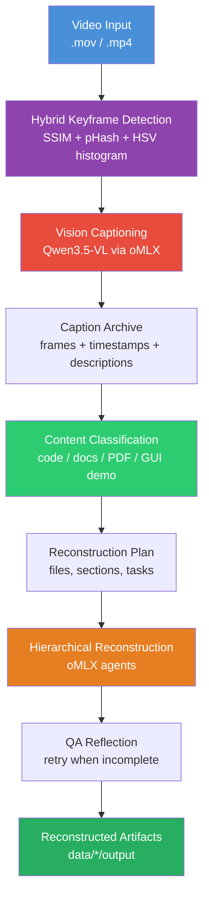
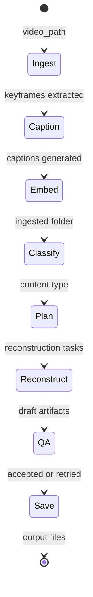

# ScreenLens

[](https://python.org)
[](https://developer.apple.com/metal/)
[](https://github.com/langchain-ai/langgraph)
[]()
[](https://github.com/ai-agents-cybersecurity)
[](https://anthropic.com)
[](LICENSE)

Local video scene intelligence for Apple Silicon. Processes screen recordings through a LangGraph-orchestrated pipeline: smart keyframe extraction, Qwen3.5-VL captioning via oMLX, CLIP embedding, vector search, and LLM-powered summarization — all running on your machine with no cloud dependencies. Inspired by NVIDIA VSS, rebuilt from scratch for Apple Silicon.

## Demo


## Architecture



## Pipeline Flow (LangGraph)



## Component Overview

| Component | Technology | Purpose |
|-----------|-----------|---------|
| Frame Extraction | **Hybrid keyframe detection** (SSIM + pHash + HSV) | Only captures distinct screens — skips duplicates |
| Vision Captioning | **Qwen3.5-VL** via oMLX (Apple Silicon native) | Dense, high-fidelity frame descriptions through oMLX's OpenAI-compatible VLM API |
| Fallback Captioning | Ollama (llama3.2-vision) | Cross-platform alternative |
| Visual Embeddings | OpenCLIP ViT-B-32 | Semantic vector representations |
| Vector Storage | ChromaDB | Optional inspection index for ingested frames |
| Reconstruction | LangGraph + oMLX | Classify recordings and rebuild source/docs/demo references |
| Orchestration | LangGraph StateGraph | Pipeline state management |
| CLI | Typer + Rich | User interface |

## Prerequisites

- **Hardware**: Apple Silicon Mac (M1+). Optimized for M3 Ultra with 512GB unified memory.
- **Python 3.11+**
- **ffmpeg**: `brew install ffmpeg`
- **oMLX**: Start the local OpenAI-compatible server on `http://127.0.0.1:8000/v1`.
- **oMLX API key**: Set `MLX_API_KEY` or `OMLX_API_KEY` if authentication is enabled. ScreenLens loads `.env` automatically, and shell exports take precedence.
- **Ollama** (for summarization): Install from [ollama.com](https://ollama.com) and pull:

```bash
ollama pull llama3.2           # Text model for summarization
ollama pull llama3.2-vision    # Only needed if using --backend ollama for captioning
```

oMLX can reuse existing MLX-format model directories and exposes models through `/v1/models`. `MLX_MODEL`, `OMLX_MODEL`, or `--omlx-model` can select the served model; otherwise ScreenLens uses `default`. Captioning requires a vision-capable model; text-only models such as DeepSeek V3/V4/R1 and GPT-OSS cannot process frames.

## Installation

For an idempotent Conda setup and launcher, run:

```bash
./setup_and_run.sh
```

The script creates a `screenlens` environment with Python 3.11 and ffmpeg when
needed, installs ScreenLens in editable mode with TUI support, creates `.env`
from `.env.example` without overwriting an existing file, and launches the TUI.
Pass a CLI command to run it instead:

```bash
./setup_and_run.sh info
./setup_and_run.sh ingest "video.mov"
```

Set `SCREENLENS_CONDA_ENV` to use a different Conda environment name.

For a manual installation:

```bash
cd screenlens
pip install -e .
```

The terminal GUI is optional:

```bash
pip install -e ".[tui]"
```

## Usage

### 1. Ingest a Video (recommended — oMLX + keyframes)

```bash
cp .env.example .env
# Edit .env with your oMLX key and model, or export these variables in your shell.
python -m src.cli ingest "Screen Recording 2026-04-04 at 8.33.55 AM.mov"
```

This uses smart keyframe detection (only captures when the screen actually changes) and the configured oMLX VLM for high-fidelity captions. Dashboard URLs such as `http://127.0.0.1:8000/admin/dashboard` are normalized to `http://127.0.0.1:8000/v1`.

### 2. Ingest with Ollama (alternative)

```bash
python -m src.cli ingest "video.mov" --backend ollama --strategy fixed_fps --fps 1.0
```

### 3. Use a Specific oMLX Model

```bash
python -m src.cli ingest "video.mov" --omlx-model mlx-community/Qwen3.5-35B-A3B-4bit
```

Captioning submits up to 4 concurrent oMLX requests per chunk by default. To override:

```bash
python -m src.cli ingest "video.mov" --batch-size 8
```

### 4. Batch-Ingest a Folder of Videos

```bash
python -m src.cli batch "/path/to/recordings/"
```

Each video gets its own data directory under `./data/<video_name>/` with separate frames, captions, embeddings, and ChromaDB collections.

### 5. Reconstruct Artifacts from Recordings

```bash
python -m src.cli reconstruct
```

Scans all folders in `./data/`, classifies each recording (Python code, Markdown doc, PDF, or GUI demo), and uses LangGraph deep agents to reconstruct the original artifacts. Features:

- **Classification** — Auto-detects content type from captions
- **Parallel sub-agents** — Fan-out via LangGraph `Send` when tasks are independent
- **Reflection QA** — Up to 3 iterations of quality review before saving
- **Output** — Reconstructed files saved to `./data/<video_name>/output/`

### 6. Verbatim Transcription (reproduce the exact text/code shown)

```bash
# List served oMLX models, labeled vision / text-only / draft
python -m src.cli models

# Transcribe a recording character-for-character
python -m src.cli transcribe input/policies.mov

# Code recordings: add the Apple Vision deterministic cross-check
python -m src.cli transcribe input/code.mov --deterministic   # requires: pip install ocrmac

# Opt in to the LLM seam/indent cleanup pass (off by default)
python -m src.cli transcribe input/doc.mov --cleanup
```

A separate pipeline from captioning. Instead of *describing* frames it **copies** them: it densely samples frames, OCRs each with a vision model (transcribe, never paraphrase), and stitches them in text space to undo scroll overlap. Designed for faithfully recovering source code, docs, and dense text from a scrolling screen recording.

- **Two models, two jobs** — a **vision** model reads pixels (`OCR_MODEL`, default `Qwen3.6-27B-bf16`); a **text** model optionally tidies seams (`LLM_MODEL`). The OCR model is probed with one real frame before processing, so a text-only choice fails instantly instead of producing empty output.
- **Thinking disabled for OCR** — a reasoning model would otherwise burn its whole token budget on chain-of-thought and never emit the transcription.
- **Cleanup is off by default** — the raw stitched OCR is already verbatim. When enabled with `--cleanup`, a per-chunk coverage guard discards any LLM output that drops content and keeps the raw chunk, so `transcript.md` can never lose text vs. `transcript.raw.md`.
- **Output** — `data/<slug>/output/transcript.md` (+ `transcript.raw.md`, `ocr/all_ocr.json`).

### 7. Check Status

```bash
python -m src.cli info
```

### 8. Launch the Terminal GUI

```bash
python -m src.cli tui
```

The Textual/Rich GUI provides inputs for video paths, data/output directories, and oMLX model selection. Use `Ingest + Reconstruct` for the main workflow: ingest the video, classify what it shows, and reconstruct the matching output from the new ingested folder.

## Keyframe Detection

The hybrid change detector uses three complementary signals to decide when the screen has actually changed:

| Signal | What it detects | Threshold |
|--------|----------------|-----------|
| **SSIM** (Structural Similarity) | Pixel-level structural changes | < 0.97 |
| **pHash** (Perceptual Hash) | Perceptual content changes via DCT | hamming >= 8 |
| **HSV Histogram** | Color distribution shifts | correlation <= 0.90 |

A keyframe is emitted when any signal triggers AND enough time has passed (min 0.5s). A forced keyframe is always emitted every 4s (configurable) to catch slow scrolls.

For a typical screen recording, this captures 5-15% of frames vs. fixed FPS, dramatically reducing captioning time while missing nothing.

## Configuration

All settings live in `src/config.py` (Pydantic models). Key parameters:

| Parameter | Default | Description |
|-----------|---------|-------------|
| `frame_extraction.strategy` | keyframe | `keyframe` (smart) or `fixed_fps` |
| `frame_extraction.max_interval_seconds` | 4.0 | Max gap between keyframes |
| `captioning.backend` | omlx | `omlx` or `ollama` |
| `captioning.omlx_base_url` | http://127.0.0.1:8000/v1 | oMLX OpenAI-compatible API URL; dashboard/root URLs are normalized |
| `captioning.omlx_model` | null | oMLX model ID; falls back to `MLX_MODEL`/`OMLX_MODEL`/`LLM_MODEL` env vars or `default` |
| `captioning.batch_size` | 4 | Concurrent oMLX caption requests per chunk |
| `captioning.max_tokens` | 32768 | Max tokens per caption |
| `captioning.disable_thinking` | true | Disable reasoning so the caption budget is used for the visible answer |
| `embedding.model_name` | ViT-B-32 | CLIP model |
| `embedding.device` | mps | Apple Silicon GPU |

## Performance Notes

The default oMLX backend sends each caption as an OpenAI-compatible vision request and lets oMLX handle scheduling, continuous batching, and KV caching server-side. `captioning.batch_size` controls how many frame requests ScreenLens submits concurrently per chunk.

On Apple Silicon with large vision inputs, **prefill (vision encoder + prompt) dominates per-frame time, not decode**. The main levers for wall-clock improvement are a smaller VLM, a smaller `frame_extraction.max_dimension`, and an oMLX concurrency value that matches the host.

## Project Structure

```
src/
  config.py          # Pydantic configuration (extraction, captioning, embedding, search)
  frame_extractor.py # Hybrid keyframe detection + fixed FPS fallback
  captioner.py       # Backends: oMLX (default) and Ollama
  embedder.py        # CLIP embedding via OpenCLIP
  vector_store.py    # ChromaDB storage + search
  pipeline.py        # LangGraph StateGraph orchestration (ingest/search/summarize)
  reconstruct.py     # LangGraph deep agents — artifact reconstruction with QA reflection
  frame_select.py    # Scroll-safe frame selection for transcribe (dense sample + drop near-dupes)
  ocr.py             # VerbatimOCR — vision OCR with capability guard, probe, anti-loop controls
  stitch.py          # Text-space stitcher — undo scroll overlap, strip headers/footers
  transcribe.py      # Verbatim transcription orchestrator + optional coverage-guarded cleanup
  omlx_client.py     # oMLX OpenAI-compatible client (shared by all pipelines)
  cli.py             # Typer CLI interface
  tui.py             # Optional Textual/Rich terminal GUI
data/
  frames/            # Extracted keyframe images
  captions/          # JSON caption files
  chromadb/          # Persistent vector database
tests/
  test_pipeline.py   # Integration tests
  test_cases.yaml    # Use-case definitions + computer-use agent script
```

## How It Compares to NVIDIA VSS

| Feature | NVIDIA VSS | ScreenLens |
|---------|-----------|-----------|
| Frame extraction | Custom + TensorRT | Hybrid keyframe detection (SSIM/pHash/HSV) |
| Vision model | NVIDIA VILA | **Qwen3.5-VL** via oMLX |
| Embeddings | TensorRT Visual Encoder | OpenCLIP ViT-B-32 |
| Vector DB | Milvus | ChromaDB |
| LLM | Llama 3.1 70B (NIM) | Ollama (configurable) |
| Hardware | NVIDIA GPU (DGX) | **Apple Silicon (M-series)** |
| Deployment | Docker + NIM | pip install |
| Cloud dependency | None (self-hosted) | None (fully local) |

## Roadmap

### Duplicate Detection
- [ ] Harden near-duplicate keyframe filtering (perceptual hash + SSIM fusion threshold tuning)
- [ ] Cross-video deduplication for multi-file ingestion
- [ ] Consider leveraging [Karpathy's autoresearch](https://github.com/karpathy/autoresearch) — its autonomous agent architecture is a natural fit for iterating on dedup thresholds and evaluating detection quality at scale

### Video Profiles

Pre-configured extraction & captioning strategies tailored to content type:

| Profile | Description | Audio | Typical Source |
|---------|------------|-------|----------------|
| **`code`** | Silent screen recording of browsing / editing code | No | IDE walkthroughs, code reviews |
| **`demo`** | Screencast with voice-over demonstrating software | Yes | Product demos, tutorials, onboarding videos |
| **`pdf`** | Continuous scroll/browse of a PDF document | No | Recorded PDF read-throughs, slide decks |
| **`meeting`** | Video call or presentation recording | Yes | Zoom/Teams recordings, webinars |

Each profile auto-tunes: frame extraction strategy, captioning prompt, chunking window, and whether the audio pipeline is activated.

### Audio Support (Whisper)
- [ ] Integrate Whisper speech-to-text via **ONNX Runtime** and/or **MLX**
- [ ] Support model sizes: `small`, `medium`, `large`
- [ ] Word-level timestamps aligned to keyframe timeline
- [ ] Fused caption+transcript context for richer semantic search
- [ ] Profile-aware activation — auto-enabled for `demo` and `meeting`, skipped for `code` and `pdf`

### Output Generators (LangGraph Deep Agents)

Agentic pipelines that consume ingestion results and produce structured deliverables:

- [ ] **Manual Generator** (`demo` profile) — Watch a software demo and auto-generate a step-by-step user manual with extracted screenshots, annotated UI elements, and navigation flow
- [ ] **PDF Summary** (`pdf` profile) — Ingest a screen-recorded PDF browse and produce a structured summary document preserving headings, key points, and referenced figures
- [ ] **Source Code Reconstruction** (`code` profile) — Scan a code walkthrough video and reconstruct/export the visible source files, function signatures, and project structure
- [ ] **Meeting Notes** (`meeting` profile) — Transcribe + summarize a recorded meeting with action items, decisions, and speaker attribution

Each generator is implemented as a LangGraph sub-graph with its own state machine, allowing composition, retry, and human-in-the-loop review before final export.
